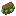
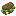

# Tea'n'Stuff

## Current Foods List

### Vegetables

- Pickles

### Sandwiches

-  Sandwich'o'Air
-  Bacon Lettuce Sandwich
-  Bacon Lettuce Tomato Sandwich
-  Bacon Lettuce Pickle Sandwich
-  Bacon Lettuce Tomato Cheese Sandwich
-  Bacon Lettuce Cheese Pickle Sandwich
-  Bacon Lettuce Tomato Cheese Pickle Sandwich

## Mod Support Megalist

### Mod Ingredients

Ingredients from Croptopia are supported (as long as recipes exist to accomodate them);

#### Croptopia Ingredients Included

-  Artichoke
-  Asparagus
-  Broccoli
-  Cabbage
-  Celery
-  Cucumber
-  Eggplant
-  Garlic
-  Ginger
-  Green Beans
-  Green Onions
-  Kale
-  Leek
-  Lettuce
-  Mustard
-  Radish
-  Rutabaga
-  Soybean
-  Spinach
-  Squash
-  Sweet Potato
-  Tomato
-  Turnip
-  Yam
-  Zucchini
-  Cauliflower
-  Onion
-  Rhubarb
-  Tomatillo

### Eating Animations

For the mod [Eating Animation](https://modrinth.com/mod/eating-animation) by theoness1.

-  **Sandwiches**

    -  Sandwich'o'Air
    -  Bacon Lettuce Sandwich
    -  Bacon Lettuce Tomato Sandwich
    -  Bacon Lettuce Pickle Sandwich
    -  Bacon Lettuce Tomato Cheese Sandwich
    -  Bacon Lettuce Cheese Pickle Sandwich
    -  Bacon Lettuce Tomato Cheese Pickle Sandwich
